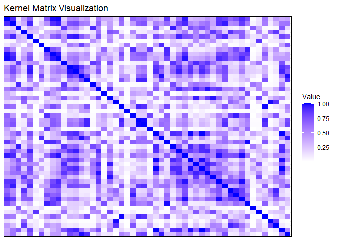
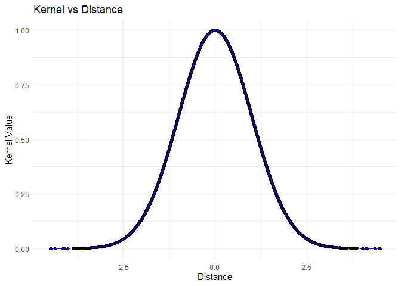

keRnel: Kernel toolbox in R
================

**keRnel** is an R package for defining, combining, optimizing, and
visualizing kernel functions. The package provides a modular,
object-oriented framework for working with a wide range of kernel types,
including basic and composite kernels, as well as tools for
hyperparameter optimization and visualization.

------------------------------------------------------------------------

## Installation

To install the package from GitHub, use the following command in R:

``` r
# install.packages("remotes")

devtools::install_github("terenceviellard/keRnel")
```

Then load the package:

``` r
library(keRnel)
```

## Available Kernels

The package includes the following kernel types:

| Kernel Type | Class Name | Key Parameters |
|----|----|----|
| Squared Exponential | SEKernel | variance_se, length_scale_se |
| Rational Quadratic | RationalQuadraticKernel | variance_rq, length_scale_rq, alpha_rq |
| Periodic | PeriodicKernel | variance_per, length_scale_per, period |
| Matern 1/2 | MaternKernel12 | length_scale_mat |
| Matern 3/2 | MaternKernel32 | length_scale_mat |
| Matern 5/2 | MaternKernel52 | length_scale_mat |
| Linear | LinearKernel | sigma2_b, sigma2_v, c |
| Constant | ConstantKernel | value_c |
| Noise | NoiseKernel | value_c |

## Quick Start

### Define and Combine Kernels

``` r
# Create a Squared Exponential kernel
se_kernel <- new("SEKernel", variance_se = 1.0, length_scale_se = 1.0)

# Create a Periodic kernel
periodic_kernel <- new("PeriodicKernel", variance_per = 1.0, length_scale_per = 1.0, period = 1.0)

# Combine kernels using sum and product
combined_kernel <- se_kernel * periodic_kernel + new("NoiseKernel", value_c = 0.1)

# Print kernel structure
pretty_print(combined_kernel)
```

    ## [1] "[[SEKernel(variance=1.00, length_scale=1.00) * PeriodicKernel(variance=1.00, length_scale=1.00, period=1.00)] + NoiseKernel(0.10)]"

### Compute Pairwise Kernel Matrices

``` r
# Generate toy data (2D)
set.seed(123)
x <- matrix(rnorm(100), ncol = 2)

# Compute kernel matrix
K <- pairwise_kernel(combined_kernel, x, x)
print(K[12,5])
```

    ## [1] 0.684859

## Hyperparameter Optimization

``` r
set.seed(666)
db <- simu_db()

n <- dim(db)[1]
mean_nul <- rep(0, n)
post_cov_nul <- diag(0.1, n)

# Optimize hyperparameters
optimized_hp <- optim_hp_L_BFGS_B(
  hp = get_hyperparameter_values(se_kernel),
  db = db,
  mean = mean_nul,
  kern = se_kernel,
  post_cov = post_cov_nul
)

# Update kernel with optimized values
updated_kernel <- set_hyperparameters(se_kernel, optimized_hp)
pretty_print(updated_kernel)
```

    ## [1] "SEKernel(variance=492.31, length_scale=0.00)"

## Visualization

### Heatmap of Kernel Matrix

``` r
p1 <- visualize_kernel(se_kernel, x)
p1
```

<!-- -->

### Kernel Values vs. Distance

``` r
# Plot kernel values vs. distance
p2 <- plot_kernel_vs_distance(se_kernel, x)
p2
```

<!-- -->

## Documentation

For a detailed tutorial, see the
[vignette](https://rpubs.com/tviellard/keRnel_advanced_usage)

## Contributing

Contributions are welcome! Open an issue or submit a pull request on the
GitHub repository.

## License

This package is released under the MIT License.
